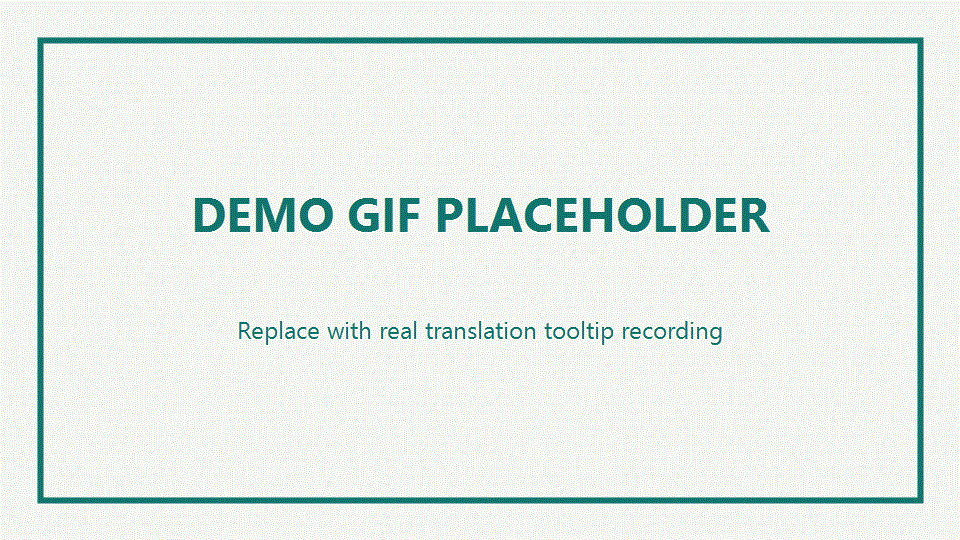

# Bilingual Text Viewer

一个用于 Edge 的 MV3 扩展：在页面翻译后，点击或划词即可查看对应原语言文本。

## 演示动图




## 功能

- 支持对已翻译页面进行原文回看
- 点击单个句段显示原文
- 划词选择后聚合显示原文
- 动态页面内容自动预处理
- 避免 Tooltip 原文被浏览器翻译器二次翻译

## 目录结构

```text
Lighting-Original/
├── manifest.json
├── _locales/
│   ├── en/messages.json
│   └── zh_CN/messages.json
├── assets/
│   ├── icons/
│   │   ├── icon16.png
│   │   ├── icon48.png
│   │   └── icon128.png
│   └── styles/
│       └── content.css
├── src/
│   ├── popup/
│   │   ├── popup.html
│   │   ├── popup.css
│   │   └── popup.js
│   ├── content/
│   │   └── content.js
│   └── background/
│       └── .gitkeep
├── README.md
└── LICENSE
```

## 本地安装

1. 打开 `edge://extensions/`
2. 开启「开发人员模式」
3. 点击「加载解压缩的扩展」
4. 选择本项目根目录

## 使用流程

1. 打开目标网页
2. 点击扩展图标，在弹窗中执行「手动启用预处理」
3. 使用 Edge 页面翻译功能
4. 翻译完成后，点击或划词查看原文

## 后续建议

- 增加后台 Service Worker 管理状态
- 为网站黑名单/白名单提供设置页
- 增加 E2E 自动化测试（Playwright）
